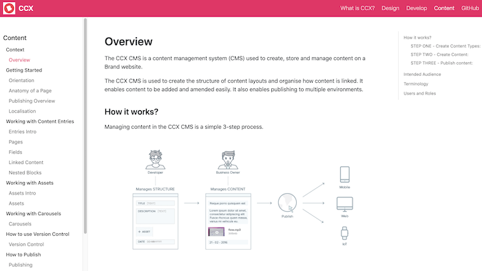

:::tip
PROJECT INFO.  
CLIENT: Ankr Inc  
DATE RELEASED: June 2021  
CATEGORIES: Docs Portal  
TAGS: 'Developer Experience', 'Web development', 'Docs Portal'  
:::

## Ankr - Web3 Crypto

Ankr provides easy node infrastructure to allow developers to spin up a node and interact with 50+ blockchains from EVM-compatible chains like Ethereum to layer 2 rollups like zkSyncEra.

First, I audited the existing docs and created new sections to place copy to match the direction of the business. There was a push towards creating new tiered RPC APIs with premium features and a move to preserve more costly decentralized cloud infrastructure for partners. It needed to be super easy to connect to chains, start making calls and use code samples to integrate.

Projects often start off with Gitbook as it's so easy to get started. Then they get to a point where their docs feel a little unwieldy and disorganised. This especially applies when there are a few writers and it's time to start implementing some review processes to ensure high quality and accuracy.

I gave the Ankr docs a rethink and a rewrite and helped them to look more professional and in tune with the Ankr Brand. I organised the main navigation to align with key audiences and strategic product divisions.

## Beamly Design Agency for Coty - Internal Design docs

The aim of this project was to provide a single source of truth for building brand websites using the CCX platform.

:::tip
PROJECT INFO.
CLIENT: Beamly (Coty)
DATE RELEASED: June 2019
CATEGORIES: Docs Portal
TAGS: 'Developer Experience', 'Web development', 'Docs Portal'
:::

3 key audiences were identified – Designers, Developers and Content Editors. A user-centric approach led the docs portal development. 

Docusaurus was evaluated and test driven as as a potential docs solution. An easy to use react static site generator, It was open source and looked quite straightforward to implement. Docusaurus worked well within a docs-as-code approach. Content was written in Markdown files, viewed on a local build then submitted as PRs for review and approval by the Engineering team lead. 

The website taxonomy and navigation was tailored to support the 3 key audience personas and identified user journeys. (This required editing javascript files and modifying css). 

The landing page provided a ‘What is CCX’ link for setting the context, introducing CCX introduction and providing whilst the ‘Design’, ‘Develop’ and ‘Content’ pathways aligned to key tasks for those user groups.

Graphics were created when this aided understanding using Inkscape and Draw.IO. Otherwise existing graphics and links to existing YouTube videos were used to improve usability and appeal to different styles of absorbing content.

## Key Outcomes:

- Quick and efficient on-boarding for new designers, developers and content editors allowed all Brand websites to be completed within a tight timeframe. 

- Greater satisfaction and fewer support requests.