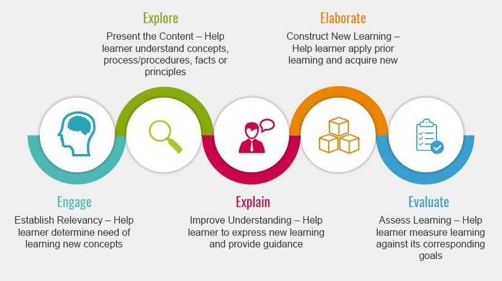
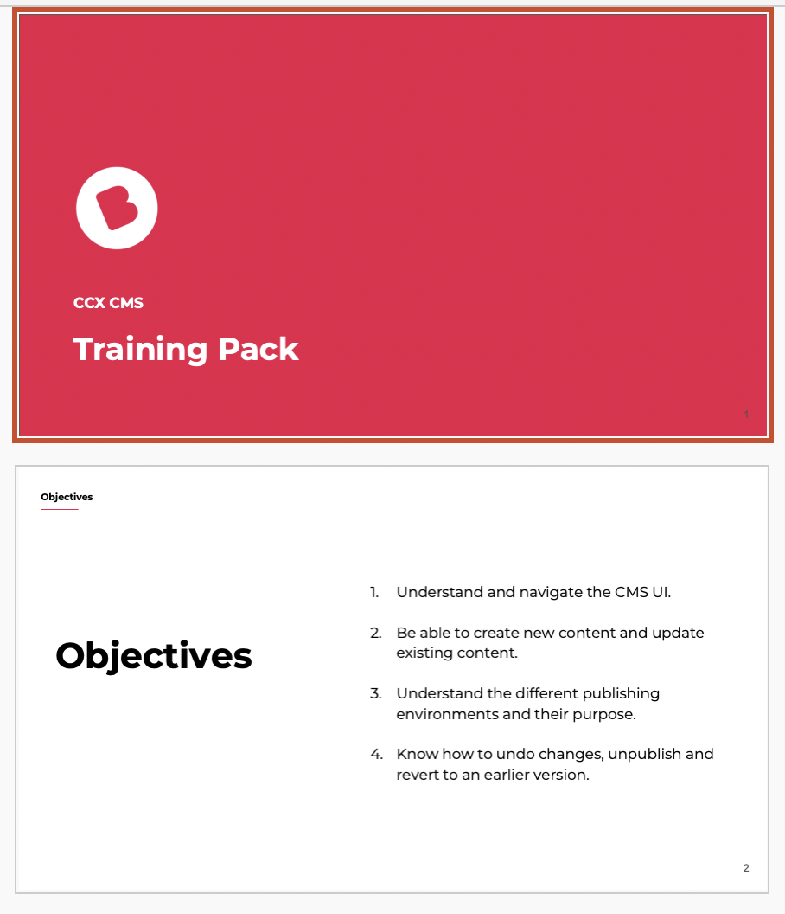
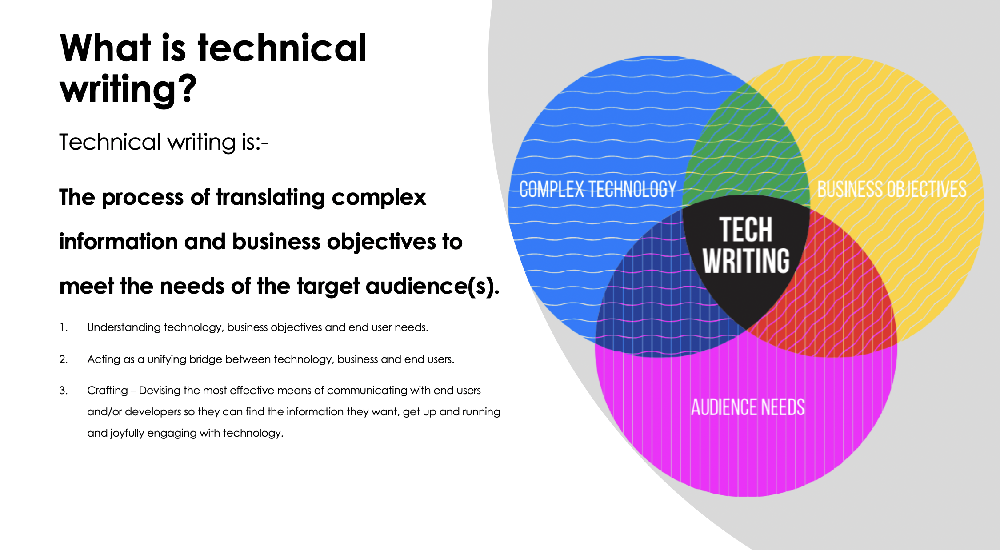

:::tip

PROJECT INFO  
CLIENTS: Multiple  
DATE RELEASED: July 2020  
CATEGORIES: Training  
TAGS: training, culture  

:::

Expanding the skills and capabilities of workers is rewarding for everybody. 

Many people have to write as part of their job but may not feel confident or competent at doing so. I support people to think about who they are writing for, the purpose of their writing and how to think about structure and format. 

As a City & Guilds qualified trainer, I have developed and delivered training and workshops to support product adoption as well as technical writing. 

I tailor workshops to meet the needs of attendees and ensure a high degree of interactivity, inclusivity and engagement. I always apply best practices in learning pedagogy.  

Example Workshop Content:

* Why technical writing matters?
* How to write for an audience 
* How to write to reduce cognitive load
* Understanding the hallmarks of good documentation.
* How to review your own and others documentation

